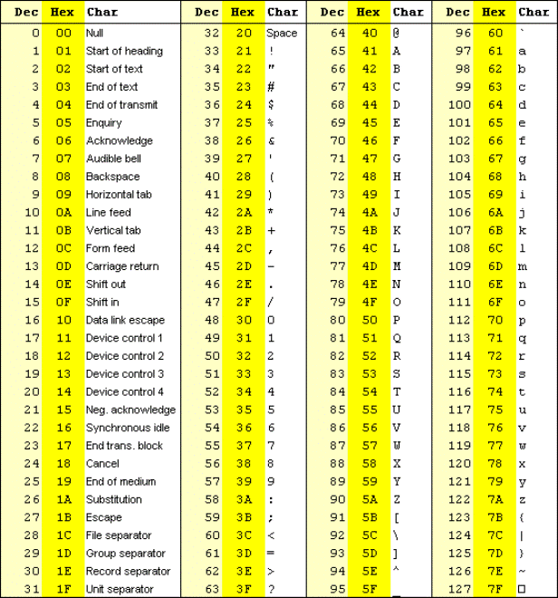

# 编码

## ASCII

ASCII 码是用来表示基本字符的字符集，使用 0 ~ 127 分别表示 127 个字符。

## Unicode

ASCII 码只包含了英文字符和常见字符，而其他语言的字符（比如汉语字符）并没有包含进去。ASCII 码使用一个字节来表示字符，不足以容纳世界上所有语言的字符。因此，能够容纳更多字符的 Unicode(Universal Multiple-Octet Coded Character Set) 字符集出现了。Unicode 采用两个字节表示字符，继续保持兼容 ASCII 码，只是将原来的 8 位表示扩展到了 16 位。

## UTF-8 UTF-16 UTF-32

Unicode 需要两个字节来表示字符，而常用的字符（如前127个字符）原本用一个字节就能表示，这样会浪费很多空间。于是，UTF 系列编码规则出现了。UTF-8 有特定的编码格式，使用 1~4 个字节来表示字符。既可以快速识别用用几个字符表示字符，也能节省空间。

UTF-16 使用固定的两个字节表示字符

UTF-32 使用固定的四个字节表示字符